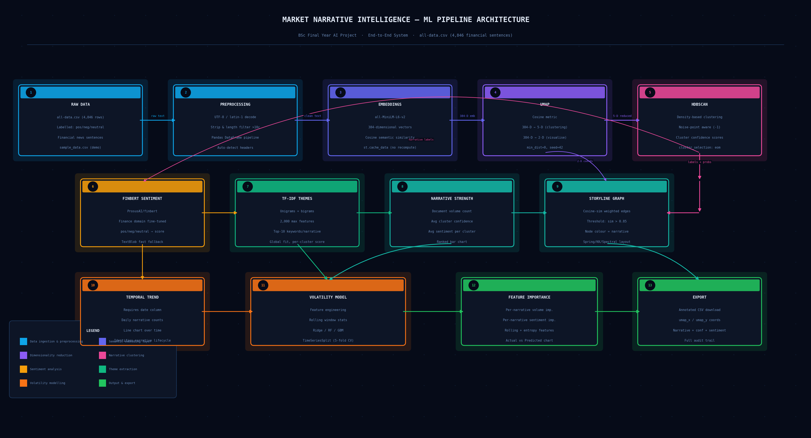

# 📈 Market Narrative Intelligence System

> Unsupervised detection of emerging financial narratives from news text — with sentiment analysis, storyline graphing, and sector volatility prediction.

[](https://python.org)
[](https://market-narratives-intelligence-jnztjxdg98b9yrcnjyaffw.streamlit.app/)
[](LICENSE)
[](https://huggingface.co/ProsusAI/finbert)

---

## 🔗 Live Demo

**[→ Launch Streamlit App](https://market-narratives-intelligence-jnztjxdg98b9yrcnjyaffw.streamlit.app/)**

Upload any CSV of financial text and get instant narrative clusters, sentiment scores, a storyline graph, and a downloadable PDF report.

---

## 📌 What It Does

Most financial NLP systems classify sentiment on individual sentences. This system goes further — it **groups sentences into narratives** (coherent market storylines) and tracks how those narratives evolve, interact, and drive volatility.

Given a set of financial news sentences, the system:

1. Encodes each sentence into a 384-dimensional semantic vector
2. Reduces dimensions with UMAP for clustering quality
3. Detects narrative clusters automatically using HDBSCAN — no need to specify how many clusters
4. Labels each cluster with a sentiment direction (bullish / bearish / neutral) via FinBERT
5. Extracts defining keywords per narrative using TF-IDF
6. Scores narrative strength by volume and confidence
7. Builds a cosine-similarity weighted storyline graph
8. Tracks narrative volume over time (if dates are provided)
9. Predicts sector volatility from narrative-strength features using Ridge / Random Forest / Gradient Boosting
10. Exports an annotated CSV and a full PDF report with all charts

---

## 🗂️ Repository Structure

```
market-narrative-intelligence/
│
├── app.py                    # Main Streamlit application (10-step pipeline)
├── data_generator.py         # Synthetic demo CSV generator
├── generate_diagram.py       # Pipeline architecture diagram generator
├── index.html                # Project landing page (Bloomberg terminal aesthetic)
├── pipeline_architecture.png # Pre-generated ML pipeline diagram
├── requirements.txt          # Python dependencies
└── README.md                 # This file
```

---

## 🧠 ML Pipeline



| Step | Component | Method | Detail |
|------|-----------|--------|--------|
| 1 | Ingestion | pandas | Auto UTF-8 / latin-1 detection, headerless CSV support |
| 2 | Embeddings | all-MiniLM-L6-v2 | 384-D dense semantic vectors, cached |
| 3 | Reduction | UMAP | 384-D → 5-D (cluster) + 2-D (visualise), cosine metric |
| 4 | Clustering | HDBSCAN | Density-based, noise-aware, no pre-set cluster count |
| 5 | Sentiment | FinBERT | ProsusAI/finbert — finance domain fine-tuned BERT |
| 6 | Keywords | TF-IDF | Bigrams, 2000 features, global fit / per-cluster score |
| 7 | Strength | Aggregation | Volume + confidence + sentiment per narrative |
| 8 | Graph | NetworkX | Cosine-sim edges > 0.85, node size = sentiment magnitude |
| 9 | Trend | Time series | Daily narrative volume (requires date column) |
| 10 | Volatility | Ridge / RF / GBM | TimeSeriesSplit 5-fold CV, no lookahead bias |

---

## 📊 Dataset

The default dataset is the **Financial PhraseBank** — 4,846 financial news sentences annotated by domain experts.

| Label | Count | % |
|-------|-------|---|
| Neutral | 2,879 | 59.4% |
| Positive | 1,363 | 28.1% |
| Negative | 604 | 12.5% |

The neutral-heavy distribution reflects real financial news — most statements are factual rather than directional, making clustering non-trivial and realistic.

---

## 🚀 Run Locally

### 1. Clone the repo
```bash
git clone https://github.com/komeramanaswini256-cpu/market-narratives-intelligence.git
cd market-narratives-intelligence
```

### 2. Create and activate virtual environment
```bash
python -m venv venv

# Windows
venv\Scripts\activate

# Mac / Linux
source venv/bin/activate
```

### 3. Install dependencies
```bash
pip install -r requirements.txt
```

### 4. Install PyTorch (CPU — smaller download)
```bash
pip install torch --index-url https://download.pytorch.org/whl/cpu
```

### 5. Run
```bash
streamlit run app.py
```

App opens at `http://localhost:8501`

---

## 📥 Input Format

Upload any CSV with a `text` column. Optional columns unlock extra features:

| Column | Type | Unlocks |
|--------|------|---------|
| `text` | string | **Required** — the news sentences |
| `date` | YYYY-MM-DD | Temporal trend + volatility prediction |
| `sentiment` | positive/negative/neutral | Ground-truth distribution chart |
| `sector` | string | Sector-level analysis |
| `return` | float | Return-based volatility target |

The app also accepts **headerless 2-column CSVs** (sentiment, text) — like the raw Financial PhraseBank format.

---

## 📄 Output

- **Interactive Streamlit dashboard** — UMAP scatter, sentiment bars, storyline graph, volatility charts
- **Annotated CSV** — original data enriched with Narrative ID, confidence, sentiment score, UMAP coordinates
- **PDF Report** — all charts + tables in a downloadable analyst-style report

---

## ⚙️ Configuration

All parameters are adjustable live from the sidebar — no code changes needed:

| Parameter | Default | Effect |
|-----------|---------|--------|
| Min cluster size | 5 | Minimum documents per narrative |
| Min samples | 2 | HDBSCAN density threshold |
| UMAP neighbours | 15 | Local vs global structure balance |
| UMAP dimensions | 5 | Clustering space dimensions |
| FinBERT | Off | Toggle domain-accurate sentiment (slower) |
| Rolling window | 7 days | Volatility feature window |
| Volatility model | Ridge | Ridge / Random Forest / Gradient Boosting |
| Graph layout | Spring | Spring / Kamada-Kawai / Spectral |

---

## 🛠️ Tech Stack

| Library | Purpose |
|---------|---------|
| `streamlit` | Interactive web UI |
| `sentence-transformers` | Semantic embeddings (all-MiniLM-L6-v2) |
| `umap-learn` | Dimensionality reduction |
| `hdbscan` | Narrative clustering |
| `transformers` | FinBERT sentiment inference |
| `scikit-learn` | TF-IDF, Ridge, RF, GBM, TimeSeriesSplit |
| `networkx` | Storyline graph construction |
| `matplotlib` | All visualisations |
| `reportlab` | PDF report generation |
| `pandas` / `numpy` | Data processing |

---

## 📁 Generate Demo Data

To generate a synthetic dataset with dates, sectors, and returns:

```bash
python data_generator.py
# Output: demo_narratives.csv (400 rows, 6 columns)
```

This unlocks the full pipeline including volatility prediction.

---

## 🔮 Future Work

- **OCR article ingestion** — feed screenshots or PDFs of news articles directly via Tesseract
- **Live news feed** — auto-pull from NewsAPI for real-time narrative detection
- **Narrative emergence alerts** — flag clusters growing >50% in the last 3 days
- **Sector heatmap** — sentiment × narrative matrix per industry sector
- **Multi-language support** — extend embeddings to non-English financial text

---

## 📜 License

MIT — free to use, modify, and distribute.

---


